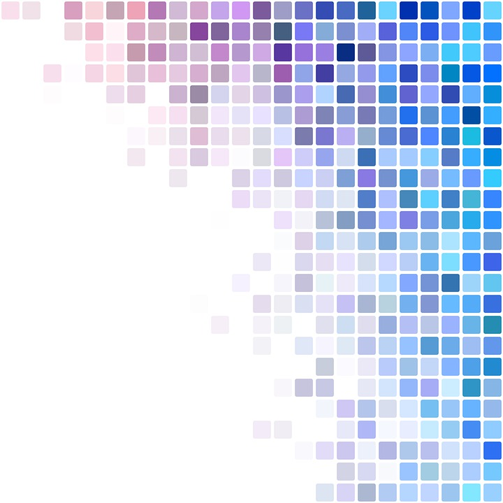
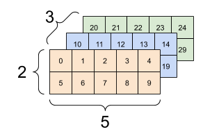
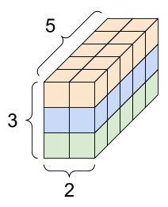

Tensorflow.js系列（三）：基于 node 使用卷积神经网络进行文本识别 - 以星纪sso验证码为例


## A) Tensor Again

### 基本回顾

在开始前，我们需要再次回顾张量（tensor）的概念，因为张量是 tensorflow 中数据的中央单元。

试想，我们对于身边的事物，我们是如何将它们进行量化的，试想面前有这样一幅画？



- 这幅画的尺寸（长和宽），我们可以用两个数字来描述，比如200px * 200px 即可记录为 ``` [200, 200] ```
- 这幅画某一个像素点的颜色，我们可以用三个数字来描述，分别为 r, g, b三个通道，可以记录为 ``` [255, 255, 255] ```


上面这些都是一维张量，一维张量通常可以描述一个单位的属性的信息。

但是事物并不总是以一个单位来呈现，试想：

- 这幅画在5天内的尺寸变化，我们可以用5个尺寸来描述，用数组表示为

    ```
    [
        [100, 100], [101, 101], [102, 102], [103, 103], [104, 104]
    ]
    ```

- 亦或是这幅画第一行的像素排列（一条线），我们可以用若干个描述像素点的数组来描述，即为

    ```
    [
        [255,, 255, 255], [0, 0, 0], ..., [100, 100, 100]
    ]
    ```


有时一维张量不足以描述现实情况，那么可以用到二维张量，也就是包含了多个一维张量的张量，接下来我们来推导三维张量可以描述什么。

- 此时我们要描述这一整幅画，就需要这样形状的张量：

    ```
    [
        [
            [255,, 255, 255], [0, 0, 0], ..., [100, 100, 100]
        ]
        [
            [255,, 255, 255], [0, 0, 0], ..., [100, 100, 100]
        ]
    ]
    ```

很明显，很多条线合到一起，就组合成了一幅画。这是一个三维张量



- 如此一来，四维张量也就可以轻易想象出来了，包含多个图片的东西是什么呢？ ---视频（想象下图每一个方块都是一个像素点）



### 张量的形状

如何计算形状？每一维所包含的元素个数，就是这一维的形状。

以下面的张量为例，他的形状是 [2, 4, 3]，可以理解为高为2，宽为4，每个像素点有3个通道的图片

```
    [
        [
            [255,, 255, 255], [0, 0, 0], [100, 100, 100], [120, 80, 70]
        ]
        [
            [255,, 255, 255], [0, 0, 0], [100, 100, 100], [120, 80, 70]
        ]
    ]
```

### 卷积神经网络

在上一期中，其实已经对卷积神经网络进行了基本的介绍，这里再次回顾一下。